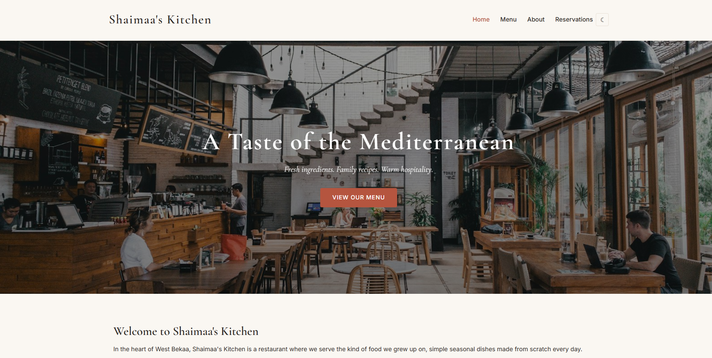
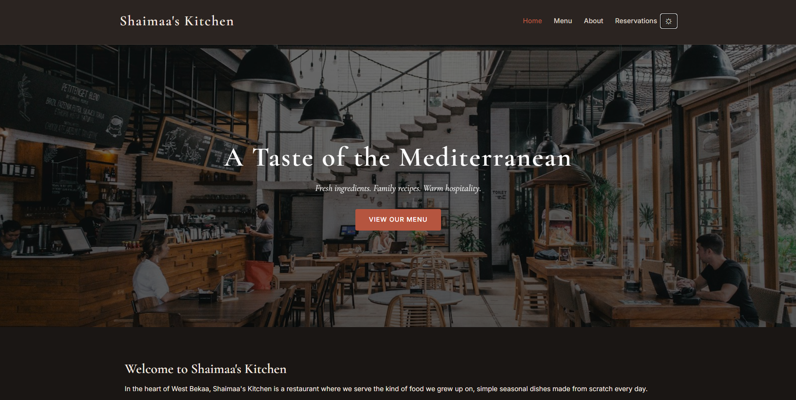
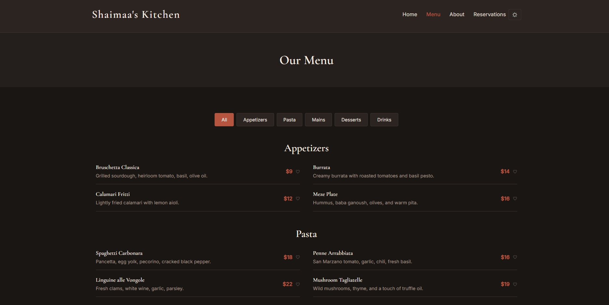
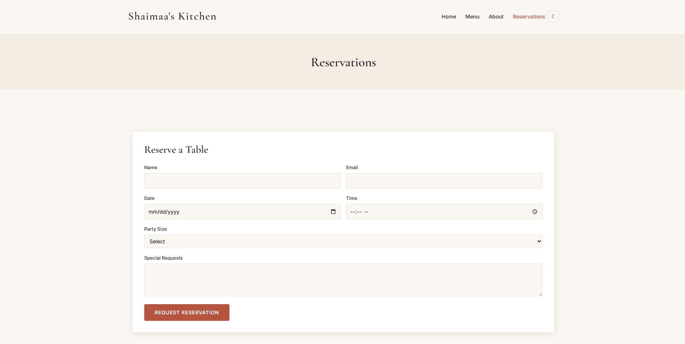

# Shaimaa's Kitchen

A responsive restaurant website for a fictional Mediterranean restaurant in West Bekaa, Lebanon. Built for CSCI390 Project Phase 2.

## Features

- Browse the full menu organized by category
- Filter dishes by category (appetizers, pasta, mains, desserts, drinks)
- Save favorite dishes with a heart icon (saved to your browser)
- Book a table with name, email, date, time, and party size
- View and cancel your reservations
- Pre-fill the reservation form with your favorite dishes
- Dark mode toggle that saves your preference

## Live Demo

https://shaimaas-kitchen.vercel.app/

## Built With

- React (Create React App)
- React Router
- Bootstrap 5
- Custom CSS
- localStorage for data persistence

## Setup

1. Clone the repository
2. Run `npm install`
3. Run `npm start`
4. Open http://localhost:3000

## Project Structure

```
src/
  components/
    Header.js
    Footer.js
  pages/
    Home.js
    Menu.js
    About.js
    Reservations.js
  hooks/
    useFavorites.js
    useTheme.js
  data/
    menuData.js
```

## Screenshots





